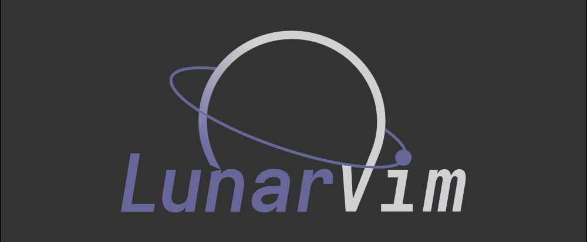
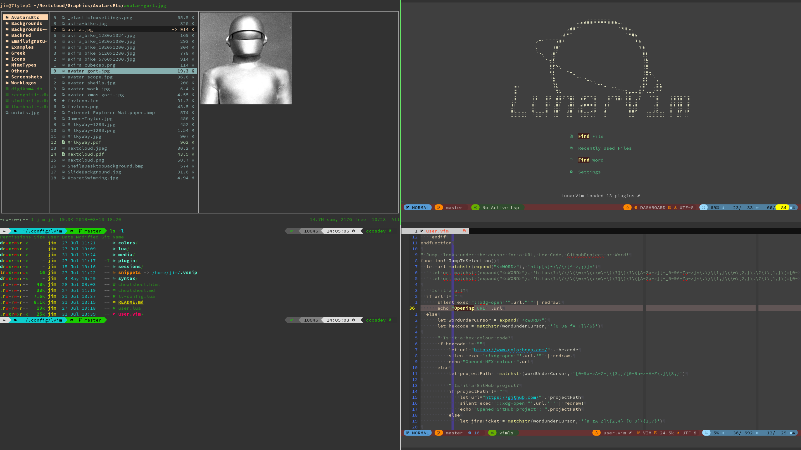
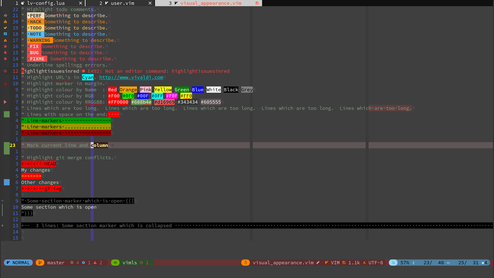
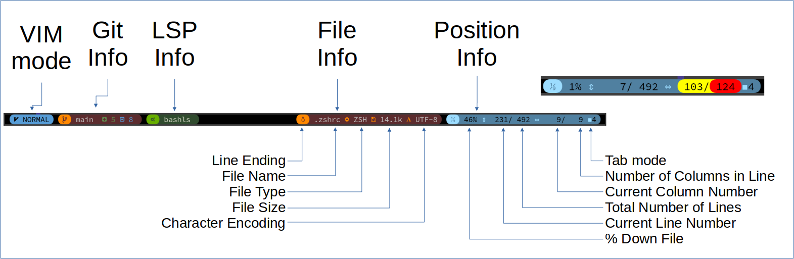
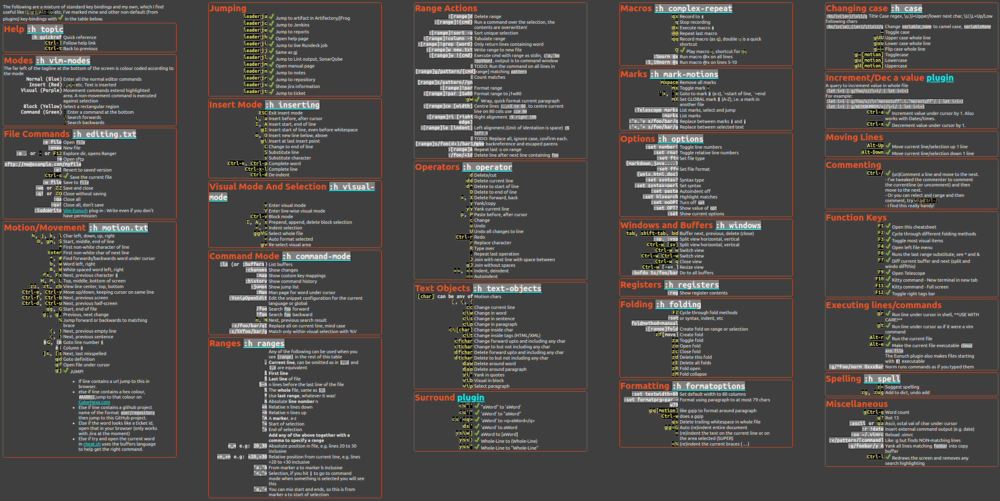

<!-- Shields -->
<!-- {{{1 -->

<!-- }}}1 -->

<!-- Main Image -->
<!-- {{{1 -->

<!-- }}}1 -->

<!-- Introduction -->
<!-- {{{1 -->

This is a set of config files for the **brilliant** configuration project
[LunarVim](https://github.com/ChristianChiarulli/LunarVim) by [Christian
Chiarulli](https://twitter.com/intent/follow?screen_name=chrisatmachine).
I've been using VI on and off as my daily editor since the early 1990's and
Christian's setup is the best I've seen so I've just plagiarized it and added a
few of my own twists.

The main changes are documented below:

- My config for GalaxyLine.
- My dashboard.
- Custom Keybindings.
- Custom Colours.
- and much more.

I intend to merge Christian's changes into my config regularly to keep up with
his brilliant work.

If your interested my website is 

<!-- }}}1 -->

# Contents

<!-- {{{1 -->

- [Installation](#installation)
- [Visual Appearance](#visual-appearance)
- [Galaxy Line](#galaxy-line)
- [Extra Plugins](#extra-plugins)
- [Configured LSP's](#configures-lsp's)
- [Key Bindings](#key-bindings-cheatsheet)
- [Some Useful Links](#some-useful-links)

<!-- }}}1 -->

# Installation

<!-- {{{1 -->

- Follow the instructions on [Christian's site](https://github.com/ChristianChiarulli/LunarVim)
- Download this repo to `~/.config/lvim`

<!-- }}}1 -->

# Visual Appearance

<!-- {{{1 -->

- I use zenburn theme. One of the reasons for this is that its available in virtually
  any plug-in/app/program that allows theming, so I can near consistent code theming
  everywhere.
- I've added vertical markers at 80 and 120 characters.
  - Galaxy line displays the current column and line length, these change colour at 80 and 120 characters.
- The current cursor line is highlighted in light red
- The current cursor column is highlighted in light blue
- Whitespace at the end of a line in highlighted in bright red.
- Margin:
  - Current line number is highlighted in Yellow
  - Relative line numbers are shown in RoyalBlue
  - Markers are shown
  - Git changes are shown
  - Folding marks are also shown in the margin

  <!-- }}}1 -->

# Galaxy line

<!-- {{{1 -->

The Galaxy line configuration can be found [here](https://github.com/jimcornmell/lvim/blob/f7db626efb3fe982a7b7c82dcf5a48e43a56400d/lua/user/galaxyline.lua)
This image shows what is in the different sections.

The line is split into 5 main sections, 3 on the left and 2 on the right:

- On the left:
  - VIM Mode is colour coded, see the init.lua for details
  - Git information
  - LSP information
- On the right:
  - File information
    - Line Ending, Linux , Mac  or Windows 
    - File Name
    - File Type
    - File Size
    - Character encoding
  - Position information - Percentage - Current Line Number / Number of lines in the file - Current column / length of current line - Tab mode,  or  and number of characters
  Note the column information is colour coded, >80 = Yellow >120 = Red.
  <!-- }}}1 -->

# Extra Plugins

<!-- {{{1 -->

I've added a few extra plugins I use to the configuration:

- [Codi](https://github.com/metakirby5/codi.vim) I alias "bc" on the command line to get a powerful calculator scratchpad using python.
- [Colorizer](https://github.com/norcalli/nvim-colorizer.lua)
- [Dial](https://github.com/monaqa/dial.nvim) I've enabled a bunch of the predefined "increment's", also added a few of my own, e.g: True<->False and full month names.  [See the config for details](lua/lv-dial/init.lua)I
- [Fugitive](https://github.com/tpope/vim-fugitive) Git plugin from Tim Pope
- [Highlighturl](https://github.com/itchyny/vim-highlighturl) Highlight urls, jump to them with <kbd>g</kbd><kbd>j</kbd>
- [Hop](https://github.com/phaazon/hop.nvim) Better motions with <kbd>S</kbd>
- [Lazygit](https://github.com/kdheepak/lazygit.nvim) <kbd>F8</kbd> to open.
- [Markdown_preview](https://github.com/iamcco/markdown-preview.nvim) Open a markdown file and ":MarkdownPreview"
- [Ranger](https://github.com/kevinhwang91/rnvimr) Display with <kbd>Leader</kbd><kbd>r</kbd>
- [Symbols outline](https://github.com/simrat39/symbols-outline.nvim) Display with <kbd>F12</kbd>
- [Todo comments](https://github.com/folke/todo-comments.nvim) With a few tweaks....
- [Vim Eunuch](https://github.com/tpope/vim-eunuch) Vim sugar for the UNIX shell commands that need it the most.  Also makes files starting with `#!` executable.
- [Vim Signature](https://github.com/kshenoy/vim-signature) A plugin to place, toggle and display marks.
- [Vim Surround](https://github.com/tpope/vim-surround) Surround.vim is all about "surroundings": parentheses, brackets, quotes, XML tags, and more. The plugin provides mappings to easily delete, change and add such surroundings in pairs.
- [Zen Mode]( https://github.com/folke/zen-mode.nvim) Toggle with <kbd>Leader</kbd><kbd>z</kbd>

<!-- }}}1 -->

# Configured LSP's

<!-- {{{1 -->

- [SQL](https://github.com/nanotee/sqls.nvim)

<!-- }}}1 -->

# Key Bindings-Cheatsheet

<!-- {{{1 -->

Note this cheatsheet is available as a HTML file, which is accessed by hitting <kbd>F1</kbd> in vim.
See my dotfiles for a simple bash script to convert this GitHut markdown file into HTML (and thus PNG).

- [Markdown Cheatsheet](cheatsheet.md)
- [HTML Cheatsheet](cheatsheet.html)
- [PNG Cheatsheet](./media/cheatsheet.png)

<!-- }}}1 -->

# Some Useful Links

<!-- {{{1 -->

|                                                          |  |                          |
| :-------------------------------------------------------------------------------------------------------------------------------------: | :------------------------------------------------------------------------------------------------------------------: | :---------------------------------------------------------------------------------------------------------------: |
|                      |     |    |
|  |                  |  |
|                                             |                                                        &nbsp;                                                        |                                                      &nbsp;                                                       |

<!-- }}}1 -->
